1장: 프로그래밍 언어와 파이썬
===

Programming Languages and Python

***

**박 진 수** 교수  
Intelligent Data Semantics Lab  
Seoul National University

***

<h3>Table of Contents<span class="tocSkip"></span></h3>
<div class="toc"><ul class="toc-item"><li><span><a href="#강의에-앞서…" data-toc-modified-id="강의에-앞서…-1">강의에 앞서…</a></span><ul class="toc-item"><li><span><a href="#하는-만큼-배운다" data-toc-modified-id="하는-만큼-배운다-1.1">하는 만큼 배운다</a></span></li><li><span><a href="#강의-교재" data-toc-modified-id="강의-교재-1.2">강의 교재</a></span><ul class="toc-item"><li><span><a href="#소스-코드,-연습문제-풀이,-부록" data-toc-modified-id="소스-코드,-연습문제-풀이,-부록-1.2.1">소스 코드, 연습문제 풀이, 부록</a></span></li><li><span><a href="#SNUON-동영상-강의" data-toc-modified-id="SNUON-동영상-강의-1.2.2">SNUON 동영상 강의</a></span></li></ul></li><li><span><a href="#강의-노트" data-toc-modified-id="강의-노트-1.3">강의 노트</a></span></li></ul></li><li><span><a href="#프로그래밍이란?" data-toc-modified-id="프로그래밍이란?-2">프로그래밍이란?</a></span><ul class="toc-item"><li><span><a href="#메모장-실행해보기" data-toc-modified-id="메모장-실행해보기-2.1">메모장 실행해보기</a></span></li><li><span><a href="#프로그래밍을-배우면" data-toc-modified-id="프로그래밍을-배우면-2.2">프로그래밍을 배우면</a></span></li><li><span><a href="#아는-것의-힘-체험하기" data-toc-modified-id="아는-것의-힘-체험하기-2.3">아는 것의 힘 체험하기</a></span><ul class="toc-item"><li><span><a href="#직접-데이터-보고-입력하기" data-toc-modified-id="직접-데이터-보고-입력하기-2.3.1">직접 데이터 보고 입력하기</a></span></li><li><span><a href="#엑셀-기능-이용하기" data-toc-modified-id="엑셀-기능-이용하기-2.3.2">엑셀 기능 이용하기</a></span></li><li><span><a href="#하지만..." data-toc-modified-id="하지만...-2.3.3">하지만...</a></span></li></ul></li></ul></li><li><span><a href="#왜-파이썬인가?" data-toc-modified-id="왜-파이썬인가?-3">왜 파이썬인가?</a></span><ul class="toc-item"><li><span><a href="#프로그래밍-언어-추이" data-toc-modified-id="프로그래밍-언어-추이-3.1">프로그래밍 언어 추이</a></span></li><li><span><a href="#프로그래머-관련-직업-트렌드" data-toc-modified-id="프로그래머-관련-직업-트렌드-3.2">프로그래머 관련 직업 트렌드</a></span></li><li><span><a href="#가장-인기가-좋은-프로그래밍-언어" data-toc-modified-id="가장-인기가-좋은-프로그래밍-언어-3.3">가장 인기가 좋은 프로그래밍 언어</a></span></li><li><span><a href="#AlphaGo-Wanted-Python-Programmers" data-toc-modified-id="AlphaGo-Wanted-Python-Programmers-3.4">AlphaGo Wanted Python Programmers</a></span></li><li><span><a href="#데이터-분석을-위한-가장-강력한-프로그래밍-언어" data-toc-modified-id="데이터-분석을-위한-가장-강력한-프로그래밍-언어-3.5">데이터 분석을 위한 가장 강력한 프로그래밍 언어</a></span></li><li><span><a href="#Transitions-between-the-different-platforms" data-toc-modified-id="Transitions-between-the-different-platforms-3.6">Transitions between the different platforms</a></span></li><li><span><a href="#Trends-from-2014-to-2017" data-toc-modified-id="Trends-from-2014-to-2017-3.7">Trends from 2014 to 2017</a></span></li><li><span><a href="#2017년-가장-인기가-많았던-데이터-사이언스-툴" data-toc-modified-id="2017년-가장-인기가-많았던-데이터-사이언스-툴-3.8">2017년 가장 인기가 많았던 데이터 사이언스 툴</a></span></li><li><span><a href="#2018년-배우고-싶은-데이터-사이언스-툴" data-toc-modified-id="2018년-배우고-싶은-데이터-사이언스-툴-3.9">2018년 배우고 싶은 데이터 사이언스 툴</a></span></li><li><span><a href="#AI-개발에-가장-적합한-5가지-프로그래밍-언어" data-toc-modified-id="AI-개발에-가장-적합한-5가지-프로그래밍-언어-3.10">AI 개발에 가장 적합한 5가지 프로그래밍 언어</a></span></li><li><span><a href="#프로그래밍-언어로서의-파이썬" data-toc-modified-id="프로그래밍-언어로서의-파이썬-3.11">프로그래밍 언어로서의 파이썬</a></span></li></ul></li><li><span><a href="#파이썬-특징" data-toc-modified-id="파이썬-특징-4">파이썬 특징</a></span><ul class="toc-item"><li><span><a href="#휘도-판-로썸(Guido-Van-Rossum)" data-toc-modified-id="휘도-판-로썸(Guido-Van-Rossum)-4.1">휘도 판 로썸(Guido Van Rossum)</a></span></li><li><span><a href="#Easy-to-learn" data-toc-modified-id="Easy-to-learn-4.2">Easy to learn</a></span></li><li><span><a href="#Very-expressive-language" data-toc-modified-id="Very-expressive-language-4.3">Very expressive language</a></span></li><li><span><a href="#크로스-플랫폼-언어(cross-platform-language)" data-toc-modified-id="크로스-플랫폼-언어(cross-platform-language)-4.4">크로스 플랫폼 언어(cross-platform language)</a></span></li><li><span><a href="#해석형-언어(interpreted-language)" data-toc-modified-id="해석형-언어(interpreted-language)-4.5">해석형 언어(interpreted language)</a></span></li><li><span><a href="#대화형-언어(interactive-mode)" data-toc-modified-id="대화형-언어(interactive-mode)-4.6">대화형 언어(interactive mode)</a></span></li><li><span><a href="#멀티패러다임(multiparadigm)-프로그래밍-언어" data-toc-modified-id="멀티패러다임(multiparadigm)-프로그래밍-언어-4.7">멀티패러다임(multiparadigm) 프로그래밍 언어</a></span></li><li><span><a href="#다양한-고급-프로그래밍-기능-제공" data-toc-modified-id="다양한-고급-프로그래밍-기능-제공-4.8">다양한 고급 프로그래밍 기능 제공</a></span></li><li><span><a href="#강력하고-풍부한-라이브러리(library)-제공-:-개발-속도가-빠름" data-toc-modified-id="강력하고-풍부한-라이브러리(library)-제공-:-개발-속도가-빠름-4.9">강력하고 풍부한 라이브러리(library) 제공 : 개발 속도가 빠름</a></span></li><li><span><a href="#엄청난-사용자-커뮤니티" data-toc-modified-id="엄청난-사용자-커뮤니티-4.10">엄청난 사용자 커뮤니티</a></span></li><li><span><a href="#뛰어난-확장성" data-toc-modified-id="뛰어난-확장성-4.11">뛰어난 확장성</a></span></li><li><span><a href="#무료(free)-소프트웨어" data-toc-modified-id="무료(free)-소프트웨어-4.12">무료(free) 소프트웨어</a></span></li></ul></li><li><span><a href="#프로그램과-프로그램-개발-절차" data-toc-modified-id="프로그램과-프로그램-개발-절차-5">프로그램과 프로그램 개발 절차</a></span><ul class="toc-item"><li><span><a href="#프로그램(program)이란?" data-toc-modified-id="프로그램(program)이란?-5.1">프로그램(program)이란?</a></span></li><li><span><a href="#프로그램-언어의-공통-기본기능" data-toc-modified-id="프로그램-언어의-공통-기본기능-5.2">프로그램 언어의 공통 기본기능</a></span></li><li><span><a href="#프로그램-개발-과정" data-toc-modified-id="프로그램-개발-과정-5.3">프로그램 개발 과정</a></span><ul class="toc-item"><li><span><a href="#Step-1-:-프로그램-논리-설계-및-개발" data-toc-modified-id="Step-1-:-프로그램-논리-설계-및-개발-5.3.1">Step 1 : 프로그램 논리 설계 및 개발</a></span></li><li><span><a href="#Step-2-:-프로그램-코드화" data-toc-modified-id="Step-2-:-프로그램-코드화-5.3.2">Step 2 : 프로그램 코드화</a></span><ul class="toc-item"><li><span><a href="#프로그래밍(programming)" data-toc-modified-id="프로그래밍(programming)-5.3.2.1">프로그래밍(programming)</a></span></li><li><span><a href="#코드화의-기본-작업" data-toc-modified-id="코드화의-기본-작업-5.3.2.2">코드화의 기본 작업</a></span></li></ul></li><li><span><a href="#Step-3-:-기계어(machine-language)로-변환(컴파일)" data-toc-modified-id="Step-3-:-기계어(machine-language)로-변환(컴파일)-5.3.3">Step 3 : 기계어(machine language)로 변환(컴파일)</a></span></li><li><span><a href="#Step-4-:-프로그램-실행과-검증" data-toc-modified-id="Step-4-:-프로그램-실행과-검증-5.3.4">Step 4 : 프로그램 실행과 검증</a></span></li></ul></li></ul></li><li><span><a href="#논리-설계-및-알고리즘-개발" data-toc-modified-id="논리-설계-및-알고리즘-개발-6">논리 설계 및 알고리즘 개발</a></span><ul class="toc-item"><li><ul class="toc-item"><li><span><a href="#의사(擬似)코드(슈도코드,-pseudocode)" data-toc-modified-id="의사(擬似)코드(슈도코드,-pseudocode)-6.0.1">의사(擬似)코드(슈도코드, pseudocode)</a></span></li><li><span><a href="#흐름도(flowchart,-순서도)" data-toc-modified-id="흐름도(flowchart,-순서도)-6.0.2">흐름도(flowchart, 순서도)</a></span></li></ul></li><li><span><a href="#Lab:-의사코드-작성하기" data-toc-modified-id="Lab:-의사코드-작성하기-6.1">Lab: 의사코드 작성하기</a></span><ul class="toc-item"><li><span><a href="#답" data-toc-modified-id="답-6.1.1">답</a></span></li><li><span><a href="#파이썬-코드로-변환-한-예시" data-toc-modified-id="파이썬-코드로-변환-한-예시-6.1.2">파이썬 코드로 변환 한 예시</a></span></li></ul></li></ul></li></ul></div>

# 강의에 앞서…

## 하는 만큼 배운다

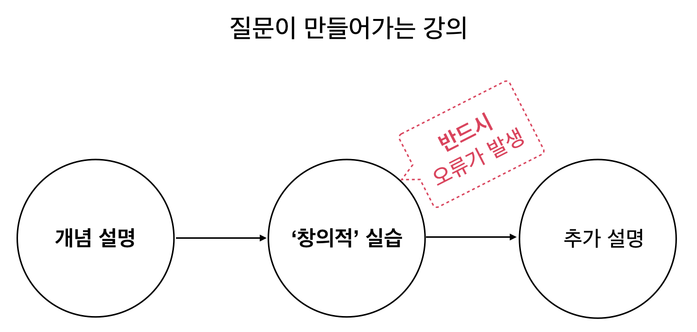

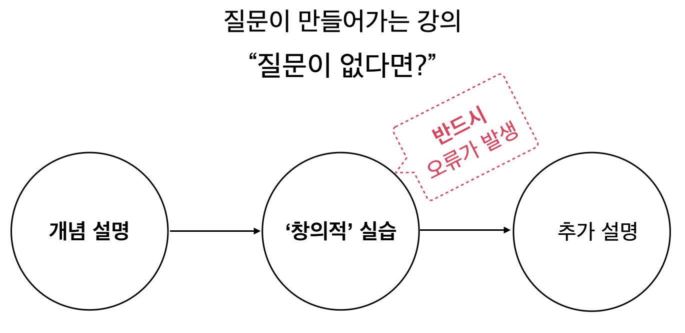

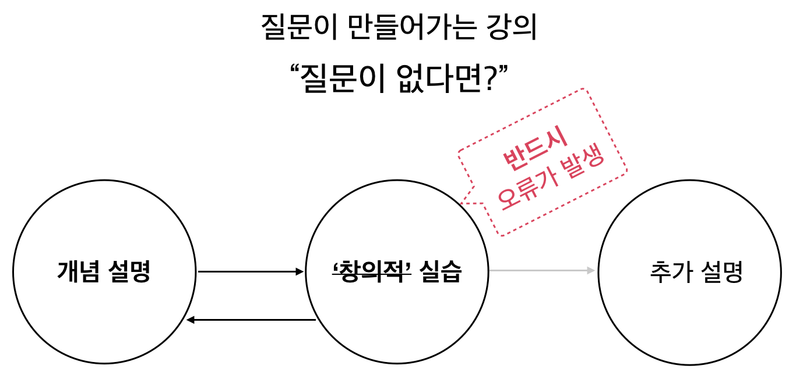

## 강의 교재

바로 쓰는 파이썬: 기초 편 | 박진수 저 | 서울대학교 출판문화원 | 2019 | ISBN 978-89-521-2886-7 


### 소스 코드, 연습문제 풀이, 부록
- <https://github.com/snu-python>  
- snupress.com 〉 고객센터 〉 자료실 〉 바로 쓰는 파이썬 

### SNUON 동영상 강의
- <https://etl.snu.ac.kr/> 접속 후 회원가입
- 로그인하고 eTL 메인 화면에서 왼쪽 메뉴 중 SNUON 〉 강좌 목록
- 검색 창에 ‘바로 쓰는 파이썬’ 검색
- 강좌 클릭 후 수강신청
- 강의실로 이동하여 동영상 강의 시청

## 강의 노트

**github.com/snu-python/lecture-notes**
- <https://github.com/snu-python/lecture-notes>

# 프로그래밍이란?

프로그래밍을 한다는 것은 어떤 의미일까?

오늘, 내일 짧게나마 프로그래밍을 배우기 전에 프로그래밍을 한다는 것의 의미를 알 필요가 있다.

## 메모장 실행해보기

윈도우 기본 프로그램인 메모장(notepad)를 실행해보자.

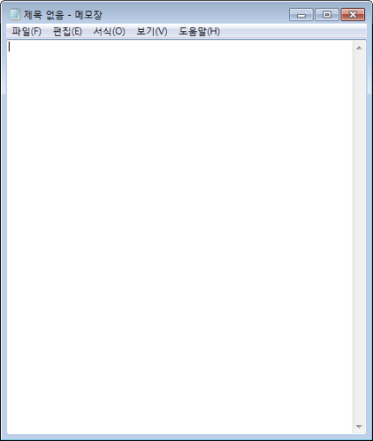

메모장에서 우리는 하얀 배경의 텍스트 입력창에 다양한 문서를 작성할 수 있다.

그렇지만, 우리는 메모장 문서 안에 표나 그림을 넣거나 동영상을 넣을 수 없다.

마이크로소프트 워드 문서에는 표나 그림을 넣을 수 있고,

마이크로소프트 파워포인트에는 심지어 동영상도 넣을 수 있다.

왜 메모장에는 표, 그림, 동영상을 넣을 수 없을까?

답은 간단하다.

**메모장을 만든 프로그래머가 그것을 허락하지 않았기 때문이다!!!**

## 프로그래밍을 배우면

프로그래밍을 배우면 우리도 우리가 원하는 프로그램을 작성할 수 있다.

프로그래밍이 우리에게 가져다 주는 것은 크게
1. **자유**와
1. **학습의 고통**이 있다.

사람마다 프로그래밍을 배우는 과정에서 느끼는 재미가 크게 다른데,

프로그래밍을 배워서 어떤 문제를 해결할 수 있을지를 생각하며 배운다면 훨씬 큰 성취감을 느낄 수 있을 것이다.

## 아는 것의 힘 체험하기

만약 다음과 같이 데이터가 세로로 입력된 엑셀 파일을 갖고 있다고 가정해보자.

이 데이터를 가로 배열로 옮기려면 어떻게 해야할까?


### 직접 데이터 보고 입력하기

데이터가 10개, 20개라면 편리하지만 만약 데이터가 10만개라면?

시간이 매우 오래걸리고 중간에 실수를 범할 가능성이 높다.


### 엑셀 기능 이용하기

엑셀에는 이런 상황을 대비해 행/열 바꿔 붙여넣기라는 기능이 있다.  
이 기능을 활용하는 것만으로 엄청난 시간과 노력을 절약할 수 있다.

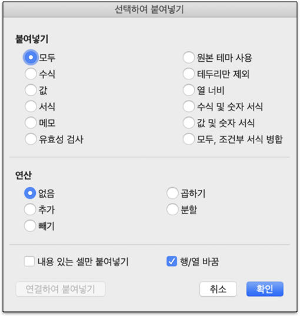

### 하지만...

우리가 겪는 모든 상황에 이렇게 딱 들어맞는 기능이 있기를 기대하는 것은 어렵다.

여러분이 프로그래밍을 할 줄 안다면 **딱 맞는 기능을 직접 만들 수 있다.**

하루에 32분씩 걸렸던 일을 프로그램을 작성해 2분 만에 끝낼 수 있다면 1년에 182.5시간을 다른 일에 쓸 수 있게 되는 것이다.

# 왜 파이썬인가?

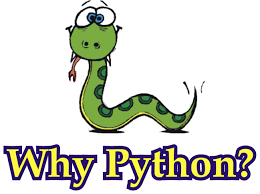

## 프로그래밍 언어 추이

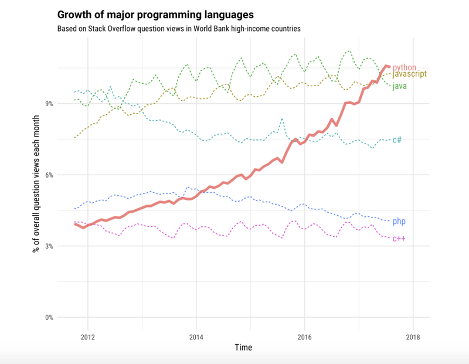  

<font size='-1'>[출처: stackoverflow.blog]</font>

## 프로그래머 관련 직업 트렌드

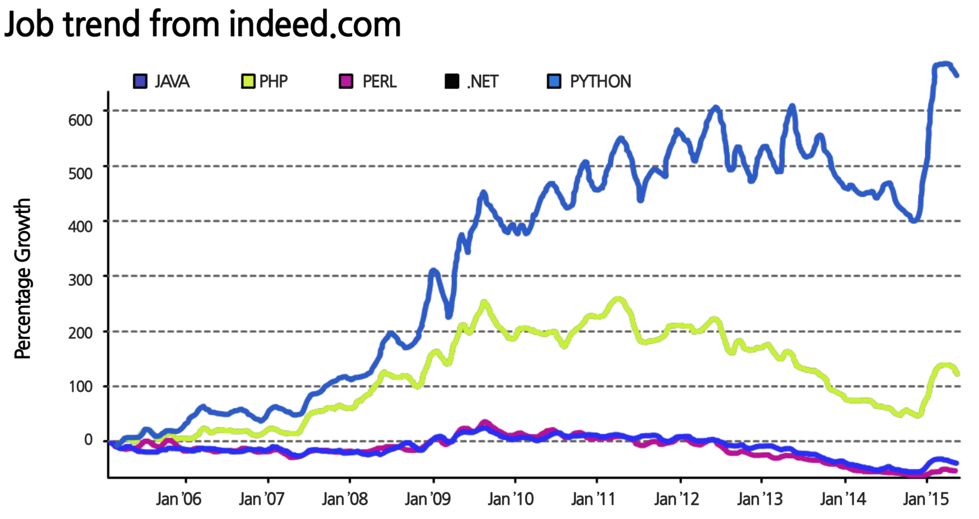

<font size='-1'>[출처: blog.smartbear.com]</font>

## 가장 인기가 좋은 프로그래밍 언어

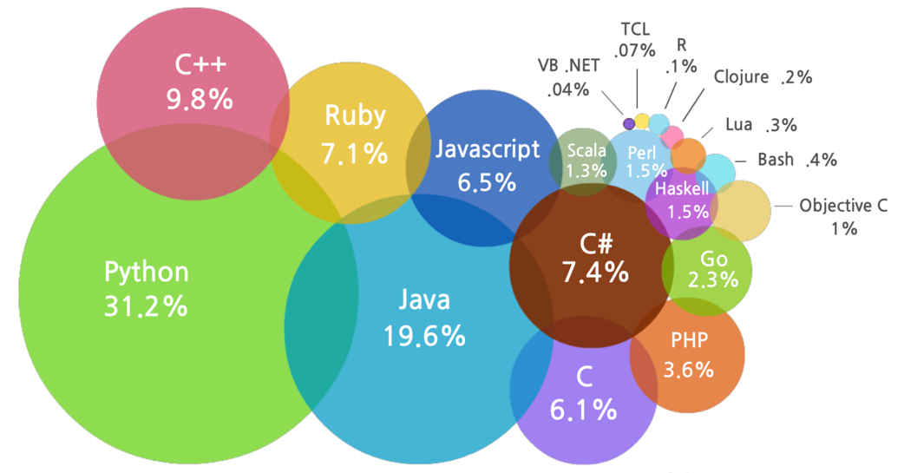

<font size='-1'>[출처: codeeval.com]</font>

## AlphaGo Wanted Python Programmers

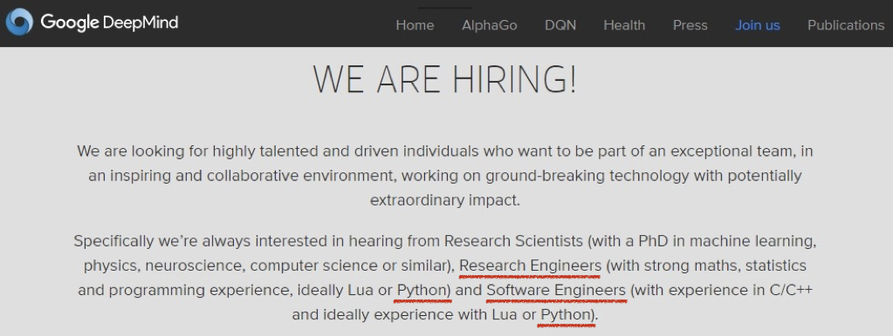

## 데이터 분석을 위한 가장 강력한 프로그래밍 언어

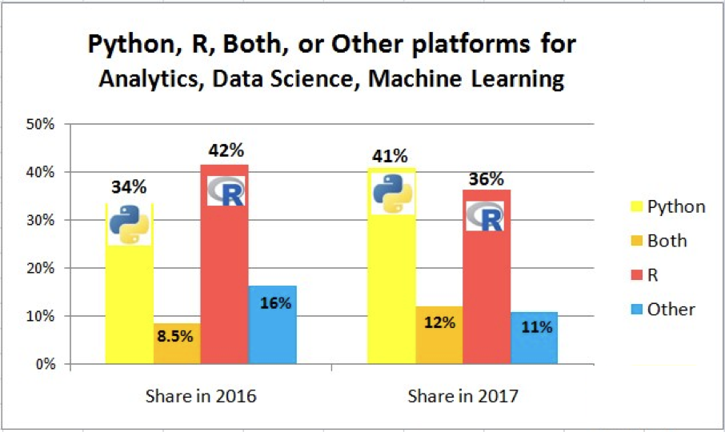

<font size='-1'>[출처: kdnuggets.com]</font>

## Transitions between the different platforms

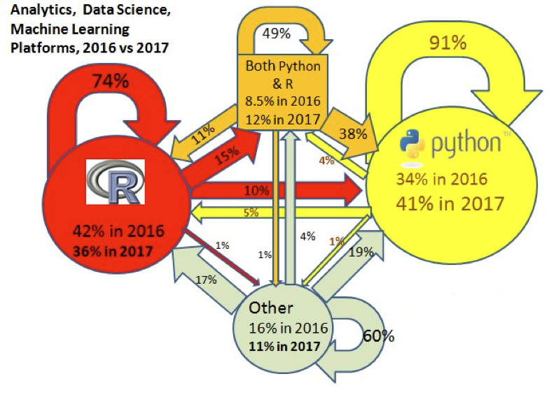

<font size='-1'>[출처: kdnuggets.com]</font>

## Trends from 2014 to 2017

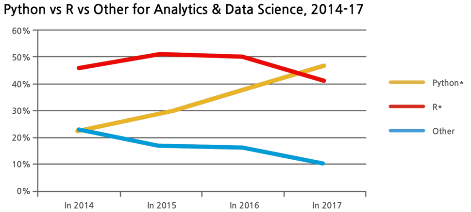

<font size='-1'>[출처: kdnuggets.com]</font>

## 2017년 가장 인기가 많았던 데이터 사이언스 툴

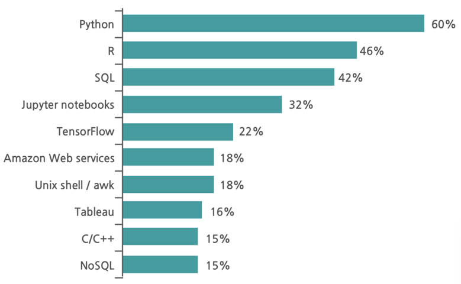

<font size='-1'>[출처: kdnuggets.com]</font>

## 2018년 배우고 싶은 데이터 사이언스 툴


<font size='-1'>[출처: kdnuggets.com]</font>

## AI 개발에 가장 적합한 5가지 프로그래밍 언어


<font size='-1'>[출처: http://www.itworld.co.kr/news/109189]</font>

## 프로그래밍 언어로서의 파이썬

- 범용
    - 자바(Java), C, C++, 베이직(Basic), …
    - **파이썬(Python)**  
- 웹 / 스크립
    - PHP, 자바스크립(JavaScript)
    - **파이썬(Python)**, 펄(Perl), 루비(Ruby)  
- 데이터베이스 / 데이터 파일
    - SQL, SPARQL
    - **파이썬(Python)**, 스칼라(Scala)  
    - 엑셀(Excel)  
- 데이터 분석
    - SPSS, SAS, R, **파이썬(Python)**
    - 엑셀(Excel)  
    
<font size='-1'>[출처: 이상구(2017)]</font>  

# 파이썬 특징

## 휘도 판 로썸(Guido Van Rossum)

- 네덜란드 출신의 개발자

## Easy to learn
- 광범위하게 사용하고 있고 초보자들도 쉽게 배울 수 있는 프로그래밍 언어
- 다른 프로그래밍 언어보다 문법이 간단하면서도 엄격하지 않음(e,g, 변수를 사용하기 전에 별도의 자료형 선언을 하지 않아도 됨)
- 문법 표현이 매우 간결하기 때문에 프로그래밍 경험이 없어도 아주 짧은 기간 내 파이썬 문법을 마스터할 수 있음(e.g., 명령문을 구분할 때 중괄호('**{**', '**}**') 대신 <**들여쓰기**(indentation)>를 사용)
    - 사람이 글을 쓸 때 문단을 구분하는 것처럼 들여쓰기를 사용해서 명령문 블록을 구분하기 때문에 글을 써내려가듯이 프로그램 논리를 자연스럽게 표현할 수 있음
        

## Very expressive language
- 같은 작업을 하는 프로그램을 C나 자바로 작성할 때보다 파이썬으로 작성할 경우  훨씬 짧은 줄로 작성이 가능

```java
public class HelloPython {
    public static void main(String[] args] {
        System.out.println("Hello Python~~~!");
    }
}
```

```python
print('Hello Python~~~!')
```

## 크로스 플랫폼 언어(cross-platform language)

- 위도우즈(Windows), 맥 OS(macOS), 리눅스(Linux), 유닉스(Unix) 등 다양한 운영체제에서 실행 가능

## 해석형 언어(interpreted language) 

- 고수준 언어(high-level language)로 작성한 소스코드(원시코드)를 기계어로 변환하는 컴파일 과정없이 바로 실행 가능(no compilation and linking)
- 자바(Java)이 경우 해석형 언어이지만 컴파일 과정이 필요함

## 대화형 언어(interactive mode)

- 코드를 대화하듯 한 줄 입력하고 실행한 후 결과를 바로 확인 할 수 있기 때문에 매우 편리
- 언어가 제공하는 다양한 기능들을 실험적으로 사용하고 테스트해 볼 수 있음

**대화형 모드 예시**  


## 멀티패러다임(multiparadigm) 프로그래밍 언어

- 객체지향형 언어(e.g., Java, Smalltalk, Ruby, Scala)
- 절차형 언어(e.g., C, Fortran, Pascal, COBOL, MATLAB)
- 함수형 언어 (e.g., Scheme, LISP)

## 다양한 고급 프로그래밍 기능 제공

- 숫자(정수, 실수, 복소수 등) 또는 문자열(ASCII, Unicode) 등 다양한 내장(built-in) 기본 자료형과 리스트, 튜플, 사전과 같은 내장 복합 자료형을 지원
- 클래스, 다중 상속(multiple inheritance), 모듈, 패키지, 예외처리(exception handling), 자동 메모리 관리 등을 지원
- 생성자(generator), 리스트/세트/딕셔너리 축약(list/set/dictionary comprehension) 등 강력한 고급 프로그래밍 기능을 지원

## 강력하고 풍부한 라이브러리(library) 제공 : 개발 속도가 빠름

- 프로그래밍에 자주 사용되는 다양한 기능이 장착된 표준 라이브러리(standard library)를 기본적으로 제공
    - 라이브러리(library) : 다양한 기능을 제공하는 함수나 모듈을 프로그램에서 쉽게 불러 사용할 수 있게 미리 작성해서 컴파일해 놓은 코드(모듈)들의 모음
    - e.g., 웹 서버 연결, 정규표현식(regular expression)을 통한 문자 검색, 파일 읽고 쓰기 등

- 기본으로 제공되는 라이브러리 뿐만 아니라, 개인이나 단체에서 만들어서 배포하는 수천개가 넘는 다양하면서도 기능이 풍부한 라이브러리가 존재하면 필요시 언제든 사용 가능
    - <pypi.python.org/pypi> 

## 엄청난 사용자 커뮤니티

- 대규모의 사용자 커뮤니티가 존재
- 도움을 손쉽게 받을 수 있을뿐 아니라 참고자료도 풍부
    - e.g., 스택오버플로우(<https://stackoverflow.com/>)에서 파이썬 관련 많은 도움을 받을 수 있음

## 뛰어난 확장성

- C, C++에서 작성된 모듈을 불러와서 사용하는 것이 가능
    - 모듈 : 미리 작성되어 편리하게 가져다 쓸 수 있는 코드를 뜻하며 여러 개의 모듈이 모이면 라이브러리가 됨
- 프로그래밍 가능한 인터페이스를 제공하기 때문에 다른 프로그래밍 언어에서 불러 사용하는 것이 가능

## 무료(free) 소프트웨어

- 무료로 다운로드 및 사용이 가능
- 개인이 제작한 애플리케이션에 탑재시킬 때도 무료
- 파이썬은 오픈소스 소프트웨어이기 때문에 자유(free)롭게 수정 및 재배포가 가능

# 프로그램과 프로그램 개발 절차

## 프로그램(program)이란?

특정한 작업을 어떻게 수행해야 하는지 그 순서를 일련의 명령어로 나열한 것이다.

## 프로그램 언어의 공통 기본기능

파이썬(Python), 자바(Java), C 언어를 포함한 모든 프로그래밍 언어는 공통적으로 다음과 같은 기본 기능들을 제공한다.

**입력** 

- 키보드나 파일 또는 별도의 장치로부터 데이터를 입력한다.

**출력** 

- 데이터를 컴퓨터 화면에 보여주거나 파일 또는 별도의 장치로 전송한다.

**처리** 
- **연산 처리** : 더하기, 빼기, 곱하기, 나누기 같은 기본적인 수학적 연산을 수행한다.
- **순차 처리** : 순서대로 작업을 수행한다.
- **선택(조건) 처리** : 특정한 조건에 따라 그에 맞는 적절한 코드를 선택해서 실행한다.
- **반복 처리** : 주어진 횟수나 조건에 따라 특정한 작업을 (주로 약간의 변화를 주면서) 반복적으로 수행한다.

## 프로그램 개발 과정

프로그램 개발은 다음과 같은 과정을 거친다.    
1. 프로그램 논리 설계 및 개발
1. 프로그램 코드화(coding)
1. 기계어(machine language)로 변환(컴파일)
1. 프로그램 실행과 검증

하지만 현실은...   


[출처: 미상]

### Step 1 : 프로그램 논리 설계 및 개발

**핵심 단계**
- 프로그램 개발 단계 중 가장 중요한 핵심 단계다.
- 알고리즘(algorithm) 개발이라고도 부른다.
- 어떤 작업 절차를 어떤 순서로 실행할지 결정하는 단계다.

**논리 설계에 사용되는 툴(tool)**
- 흐름도(flowcharts) / 순서도
- 의사(擬似)코드(슈도코드, pseudocode)
- 일상어(자연어)

**탁상 검사(desk-checking)**
- 눈으로 프로그램의 논리를 검사하기 때문에 탁상 검사라도고 부른다.
- 언어적 문법은 이 단계에서 고려하지 않는다.

**논리적 오류(logic(al) errors)**

- 프로그램이 정상적으로 실행되는 것 같지만 잘못된 결과가 나오는 경우를 말한다.
- 프로그램 논리 설계를 잘 하면 논리적 오류를 줄일 수 있다.

**흐름도(flowcharts) 예시**

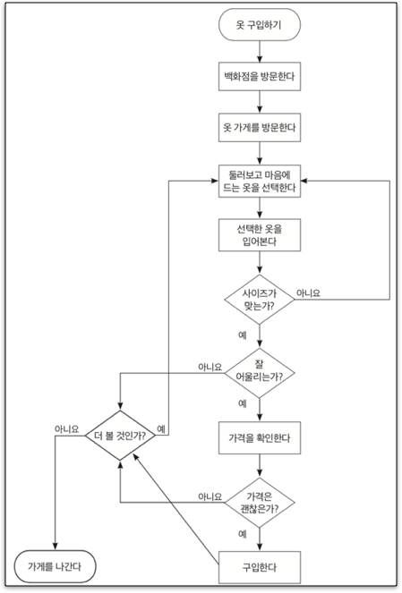

### Step 2 : 프로그램 코드화

#### 프로그래밍(programming)

- 파이썬(Python), 자바(Java), R, 루비(Ruby), C, C++, 비주얼 베이직(Visual Basic), SQL 등의 해당 - 프로그래밍 언어 문법에 맞추어 코드를 작성
- 인간 언어처럼 프로그래밍 언어도 각기 다른 표현과 문법을 가지고 있음
- 일반적으로 프로그램 논리개발보다 코드화 작업이 더 쉬움

**파이썬 코드 예시**

```python
def get_tags(text, ntags=100, multiplier=1):
    tx = Okt()    
    nouns = [noun for sentence in text 
                for noun in tx.nouns(sentence)]
    
    count = Counter(nouns)

    return [{'color': color(), 'tag': n, 'size': c * multiplier}
            for n, c in count.most_common(ntags)]
```

#### 코드화의 기본 작업

**선언**(declaration) : 프로그램에서 사용될 자료형(data type)를 컴퓨터에게 알려주는 단계
- 데이터는 사용되기 전에 반드시 미리 선언
    - 일반적으로 코드화 작업 앞부분에서 선언
- 자료형을 선언함으로써 메모리에 차지할 저장 공간과 쓰임새를 컴퓨터에게 미리 알려줌

**입력**(input) : 컴퓨터에 데이터를 입력하는 것
- 사람으로부터 : 키보드, 마우스, 펜 등  
- 파일로부터 : 텍스트 파일, 데이터베이스, 웹 페이지 등  
- 센서로부터 : 빛, 동작 감지,  생체인식 등

**처리**(processing) : 프로그램에 의해 수행되는 작업
- e.g., 급여 계산, 체스 게임에서 말의 이동

**출력**(output) : 결과 또는 답
- 화면에 표시
- 파일로 저장
- 종이에 출력

**입력받은 값에 2를 곱하여 출력하는 프로그램 예시(일상어로 작성)**


### Step 3 : 기계어(machine language)로 변환(컴파일)

**컴퓨터는 1 또는 0 밖에 모른다.**

- 소프트웨어를 통해 프로그램을 컴퓨터가 이해할 수 있는 기계어(0과 1)로 변환  
- 다양한 프로그래밍 언어가 있지만 컴퓨터는 오로지 1 또는 0만 이해할 수 있기 때문에 어떤 언어든지 기계어로 변환이 필요

**컴파일러(compiler)와 인터프리터(interpreter)**

- 일상어와 유사한 형태를 지닌 고수준 프로그래밍 언어를 저수준 기계어로 변환해주는 방식

**문법 오류(syntax error)**

- 컴파일러가 코드를 변환할 수 없을 때 문법 오류가 발생
- 원인
    - 오타
    - 잘못된 문법
- 코드에서 잘못된 부분을 수정한 뒤 다시 변환(recompile)해야 함

### Step 4 : 프로그램 실행과 검증

**프로그램 오류의 종류와 디버깅(debugging)**

- **문법 오류**(syntax error) : 오류 수정이 쉬움(즉, 버그 잡기가 쉬움)
- **런타임 오류**(runtime error) : 예외(exception) 처리를 해야 함
- **논리 오류**(logical error) : 오류 없이 프로그램이 실행되지만 예상한 결과가 나오지 않는 경우
    e.g., 1 / 2 * 3
- 문법 오류는 컴파일 단계에서, 런타임 오류와 논리 오류는 실행 단계에서 발생

**실행 단계에서의 오류**

- 문법 오류가 없는 프로그램이라도 실행단계에서 오류가 발생하지 않는다고 말할 수 없음
- 실행 단계에서 오류를 피하기 위해서는 샘플 데이터를 넣어 테스트 해보는 것이 좋음
- 샘플 데이터는 신중히 선택하고 오류 발생 가능한 다양한 경우의 수를 고려 —> be a creative pessimist!
- 발견된 오류로 인해 프로그램 논리를 변경해야 할 수도 있음

# 논리 설계 및 알고리즘 개발

특정한 작업을 수행하기 위한 필요한 과정을 순서대로 나열하는 것을 말한다.
- 반드시 거쳐야 하는 과정들을 논리적 순서대로 정리해서 알고리즘을 생성한다.
- 알고리즘(algorithm) : 특정한 작업을 수행하기 위해 필요한 과정들을 논리적으로 나열한 것

### 의사(擬似)코드(슈도코드, pseudocode)

- 실제 프로그래밍 언어가 아닌 유사한 형태의 언어나 일상어 형태로 작성한 코드
- 프로그램 설계 시에만 사용하므로 문법(구문) 오류를 신경 쓸 필요가 없음
    - 컴파일 또는 실행에 사용하는 코드가 아님(가짜 코드)
- 의사코드는 어떤 프로그램 언어로든지 실제 코드로 옮겨 적는 것이 가능

- e.g., 녹차 만들기
    - 주전자에 물을 넣는다;
    - 주전자의 물을 끓인다;
    - 주전자의 물이 끓으면 불을 끈다;
    - 컵에 티백을 넣는다;
    - 컵에 물을 붓는다;
    - 약간 기다린 뒤 티백을 꺼낸다;
    - 마신다;
    

**의사코드 예시**

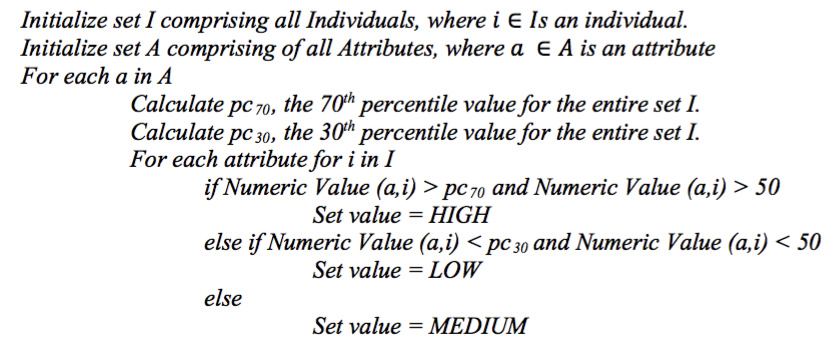

### 흐름도(flowchart, 순서도)

프로그램이 처리되는 과정을 시각적으로 나타낸 도표

- 단말기호(terminal symbol)
    - 프로그램의 시작과 끝을 나타냄 

- 비교/판단기호(decision  symbol) 

- 입출력기호(input and output symbol)  

- 처리기호(processing symbol)  

각 기호들은 화살표로 연결되어 프로그램의 처리 과정을 나타냄

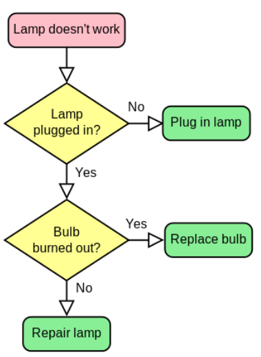

<font size='-1'>[출처: https://en.wikipedia.org/wiki/Flowchart]</font>

## Lab: 의사코드 작성하기

사용자가 입력한 값이 짝수인지 홀수인지 구하는 논리를 의사코드로 작성해보자.

***
**THE END**